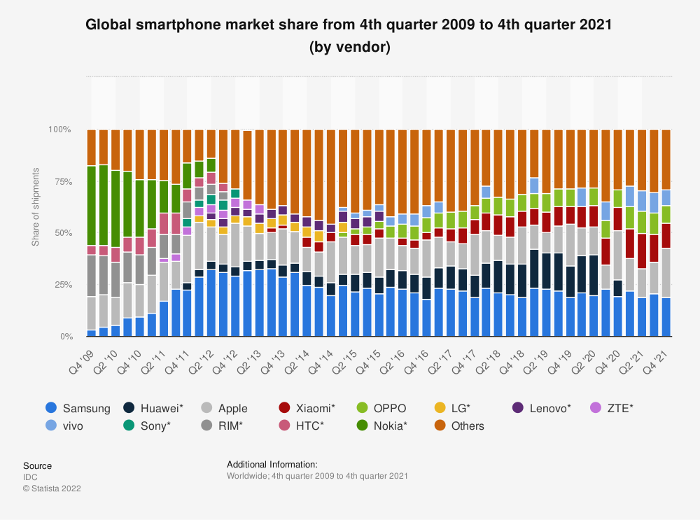
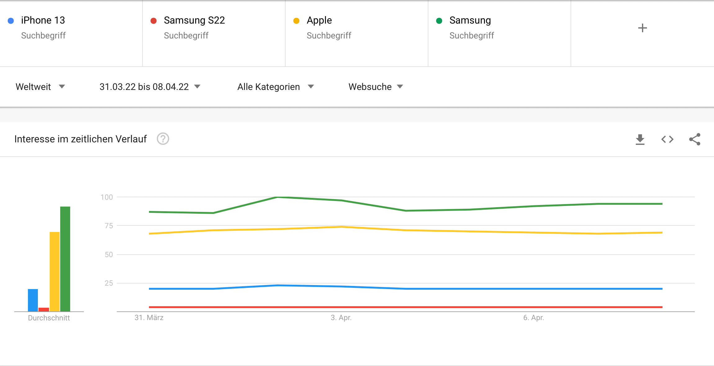

# Analysis of Samsung S22 and Apple iPhone 13

## The Smartphone Market

The global smartphone market has experienced multiple market leaders over the past few years. The only two major brands that remained over the years were Apple and Samsung. Those two brands are compared regularly and are competing over the market share. While Samsung was the market leader in the first three quarters in 2021. In September 2021, Apple released its new iPhone model with the generation 13 and gained market share, taking over the market leader position. In February 2022, Samsung also released the new model in its Galaxy series. Those two phones are the flagships in the current smartphone market.



Source: [IDC. (2022). Global smartphone market share from 4th quarter 2009 to 4th quarter 2021 (by vendor). Statista. Statista Inc..](https://www.statista.com/statistics/271496/global-market-share-held-by-smartphone-vendors-since-4th-quarter-2009/) Accessed: April 14, 2022.

## Samsung Galaxy S22

The Samsung Galaxy S series is the high-end model produced and sold by Samsung, a South Korean multinational electronics company. The S series has 13 generations. Together with the Galaxy Z and Galaxy Note (discontinued) series, the S series serves as flagship models ([Wikipedia, n.d.)](https://en.wikipedia.org/wiki/Samsung_Galaxy_S_series "Wikipedia Samsung Galaxy S series"). Samsung S series uses the open source operating system Android ([Samsung](https://www.samsung.com/ie/smartphones/galaxy-s22-ultra/)).

In February 2022 the model S22 was released in three variants: S22, S22 Plus (also: S22+) and S22 Ultra ([Wikipedia, n.d.)](https://en.wikipedia.org/wiki/Samsung_Galaxy_S_series "Wikipedia Samsung Galaxy S series"). It comes in the colours that are shown in the picture below, namely: phantom white, burgundy, phantom black and green ([Samsung](https://www.samsung.com/ie/smartphones/galaxy-s22-ultra/)). Also the S22 Ultra variant comes with an so-called "S Pen" which lets the user write on their phone and can be recharged within the phone ([Samsung](https://www.samsung.com/ie/smartphones/galaxy-s22-ultra/)).

Samsung advertises the S22 series with the following features:

-   "The phone that makes everyday epic

-   Nightography camera

-   A battery that lasts the day and beyond

-   Our fastest chip ever"

(Source: [Samsung](https://www.samsung.com/ie/smartphones/galaxy-s22/))

[{width="707"}](https://img.global.news.samsung.com/global/wp-content/uploads/2022/02/Galaxy-S22-S22-pr_main1.jpg)

[Picture Source](https://img.global.news.samsung.com/global/wp-content/uploads/2022/02/Galaxy-S22-S22-pr_main1.jpg)

## Apple iPhone 13

The Apple iPhone series is the only smartphone series produced and sold by Apple Inc, an US-American multinational technology company ([Wikipedia](https://en.wikipedia.org/wiki/IPhone)).

The generation 13 was released in September 2021 in three variants: iPhone 13, iPhone 13 mini, iPhone 13 Pro, iPhone 13 Pro Max and iPhone SE. The regular variant and mini can be bought in the colours: green, pink, blue, midnight, starlight, red. The variants Pro and Pro Max are available in: alpine green, silver, gold, graphite, sierra blue. The iPhone SE is available in: midnight, starlight, red ([Apple](https://www.apple.com/iphone/)).

Apple advertises the iPhone Pro with the following features:

-   "A dramatically more powerful camera system.

-   A display so responsive, every interaction feels new again.

-   The world's fastest smartphone chip.

-   Exceptional durability.

-   And a huge leap in battery life." ([Samsung](https://www.apple.com/iphone-13-pro/))

[{width="714"}](https://encrypted-tbn0.gstatic.com/images?q=tbn:ANd9GcRV7Zc7XpTER8ja_PrtuIxqsapjs01ElsuqKQ&usqp=CAU)

[Picture Source](https://www.apple.com/newsroom/images/product/iphone/standard/Apple-iPhone13-Pro-color-lineup-220308_big_carousel.jpg.slideshow-xlarge.jpg)

## Comparison of Features

|                             | Samsung S22                                                                            | Apple iPhone 13                           |
|-----------------------------|----------------------------------------------------------------------------------------|-------------------------------------------|
| **Starting Price**          | \$799                                                                                  | \$799                                     |
| **Screen size**             | 6.1 inches (2340 x 1080)                                                               | 6.1 inches (2532 x 1170)                  |
| **Refresh rate**            | 48Hz-120Hz adaptive                                                                    | 60Hz                                      |
| **CPU**                     | Snapdragon 8 Gen 1 (US); Exynos 2200 (K)                                               | A15 Bionic                                |
| **RAM**                     | 8GB                                                                                    | 4GB (based on teardowns)                  |
| **Storage**                 | 128GB, 256GB                                                                           | 128GB, 256GB, 512GB                       |
| **Rear cameras**            | 50MP wide (f/1.8); 12MP ultrawide (f/2.2); 10MP telephoto (f/2.4) with 3x optical zoom | 12MP main (f/1.6), 12MP ultrawide (f/2.4) |
| **Front camera**            | 10MP (f/2.2)                                                                           | 12MP (f/2.2)                              |
| **Battery size**            | 3,700 mAh                                                                              | 3,227 mAh (based on teardowns)            |
| **Battery life (Hrs:Mins)** | 7:51                                                                                   | 10:33                                     |
| **Charging speeds**         | 25W wired, 15W wireless                                                                | 20W wired; 15W wireless                   |
| **Size**                    | 5.7 x 2.8 x 0.3 inches                                                                 | 5.8 x 2.8 x 0.3 inches                    |
| **Weight**                  | 5.9 ounces                                                                             | 6.14 ounces                               |
| **Colors**                  | Black, white, green, pink gold                                                         | Black, white, blue, pink, red, green      |

Source: <https://www.tomsguide.com/face-off/samsung-galaxy-s22-vs-iphone-13>

## Objectives of our Research

-   Suggestions to customers about the products based on other customers' opinions

-   Effective decision making opinion to the customer

-   Feedback provided to the companies to improve their product and business

    -   What features did customers liked most?

    -   What are features that can be improved?

## Methodology of our Research

# Twitter Analysis

```{r Initialising Packages, include=FALSE}
library(base64enc)
library(data.table)
library(dplyr)
library(ggplot2)
library(ggraph)
library(httpuv)
library(httr)
library(igraph)
library(openssl)
library(plyr)
library(RCurl)
library(ROAuth)
library(rtweet)
library(sentimentr)
library(SnowballC)
library(stopwords)
library(stringr)
library(syuzhet)
library(textclean)
library(textmineR)
library(tidyr)
library(tidytext)
library(tidyverse)
library(tm)
library(topicmodels)
library(twitteR)
library(widyr)
library(wordcloud)
```

```{r Setup twitter, include=FALSE}
#### setting the working directory ####
#setwd("/Users/Lily/Library/Mobile Documents/com~apple~CloudDocs/Trinity College Dublin/BU7147 Social Media Analysis/Group Assignment/Social-Media-Analytics")

#### initializing keys ####
#bearer_token<-"#######"
#consumer_key<-"#######"
#consumer_secret<-"#######"
#access_token<-"#######"
#access_token_secret<-"#######"

#setup_twitter_oauth(consumer_key=consumer_key,
                    # consumer_secret=consumer_secret,
                    # access_token=access_token,
                    # access_secret=access_token_secret)
```

## Data Extraction and Cleaning

### Samsung S22

We decided to extract data from Twitter with the keywords "Samsung S22" and the hashtag "\#samsungs22" from 31.03.2022 - 08.04.2022 as we do not have a premium license to get access to the full timeline of tweets on the TwitterAPI.

We excluded from our query the users ShopeeID, \_arllee and all retweets for the keywords "Samsung S22" because there were multiple thousands of tweets about a competition to win a Samsung mobile phone which caused a lot of duplicated data.

As well, we identified nine users which were creating advertising spam and non-valuable tweets that we had to exclude: "whitestonedome", "FromKorea5", "dome_glass", "Whitestone_DE", "whitestone_UK", "jp_whitestone", "Whitestone\_\_FR", "WhitestoneJapan", "WhitestoneEU".

In total we could gather 3846 tweets.

```{r Extracting Tweets about Samsung from Twitter, eval=FALSE, include=FALSE}
#### Getting Tweets about Samsung ####
# stweets1 <- searchTwitter("#samsungs22 -filter:retweets", n=10000, lang="en", retryOnRateLimit = 100)
# sdf1 <- twListToDF(stweets1)
# View(sdf1)
# 
# stweets2 <- searchTwitter("Samsung + S22 -@ShopeeID -@_arllee -filter:retweets", n=10000, lang="en", retryOnRateLimit = 100)
# sdf2 <- twListToDF(stweets2)
# View(sdf2)
# 
# sd2_users <- sdf2 %>%
#   distinct(screenName, id) %>%
#   group_by(screenName) %>%
#   summarise("number of tweets" = n())
# View(sd2_users)
# sum(sd2_users$`number of tweets`)
# 
# ad_tweets <- c("whitestonedome", "FromKorea5", "dome_glass", "Whitestone_DE", "whitestone_UK", "jp_whitestone", "Whitestone__FR", "WhitestoneJapan", "WhitestoneEU")
# 
# sdf2_filter <- sdf2 %>%
#   filter(!screenName %in% ad_tweets)
# View(sdf2_filter)
# 
# sd2_users2 <- sdf2_filter %>%
#   distinct(screenName, id) %>%
#   group_by(screenName) %>%
#   summarise("number of tweets" = n())
# View(sd2_users2)
# 
# samsung_df <- rbind(sdf1, sdf2_filter)
# View(samsung_df)
# write.csv(samsung_df,"Samsung_df.csv")
```

Our initial data frame has 17 attributes. You can find the meaning of each of the attributes here on the [Twitter Developer Platform](https://developer.twitter.com/en/docs/twitter-api/v1/data-dictionary/object-model/tweet).

```{r Samsung Read Data, echo=FALSE}
##### Samsung: Use this dataframe from now on so we work on same data #####
samsung_df <- read.csv("Samsung_df.csv")
head(samsung_df)
```

In the following code we checked that the data.frame was correctly formatted:

```{r Samsung Data Structure, echo=FALSE}
str(samsung_df)
```

### Apple iPhone 13

We extracted data for the search terms "iPhone 13" excluding retweets and the hashtag "\#iphone13" from the TwitterAPI. Similarly, to the Samsung S22 we had to exclude certain users which were advertising ("whitestonedome", "FromKorea5", "domeglassapple") and competitions to win an iPhone when retweeting or copy-pasting a specific text ("Join the event to win an iPhone 13!"). Also, we had a high number of tweets which were randomly posting brand names, e.g. "rolex iphone" in one tweet.

In total we could gather 8369 tweets.

```{r Extracting Tweets about Apple from Twitter, eval=FALSE, include=FALSE}
#### Getting Tweets about Apple ####
# atweets1 <- searchTwitter("iPhone + 13 -filter:retweets", n=10000, lang="en", retryOnRateLimit = 100)
# adf1 <- twListToDF(atweets1)
# View(adf1)
# 
# adf_users <- adf1 %>%
#   distinct(screenName, id) %>%
#   group_by(screenName) %>%
#   summarise("number of tweets" = n())
# View(adf_users)
# 
# adf_replies <- adf1 %>%
#   distinct(replyToSN, id) %>%
#   group_by(replyToSN) %>%
#   summarise("number of replies to user" = n())
# View(adf_replies)
# 
# apple_ad_tweets <- c("whitestonedome", "FromKorea5", "domeglassapple")
# 
# adf_filter <- adf1 %>%
#   filter(!screenName %in% apple_ad_tweets)
# View(adf_filter)
# 
# atweets2 <- searchTwitter("#iphone13 -filter:retweets", n=10000, lang="en", retryOnRateLimit = 100)
# adf2 <- twListToDF(atweets2)
# View(adf2)
# 
# adf_users2 <- adf2 %>%
#   distinct(screenName, id) %>%
#   group_by(screenName) %>%
#   summarise("number of tweets" = n())
# View(adf_users2)
# 
# adf_replies2 <- adf2 %>%
#   distinct(replyToSN, id) %>%
#   group_by(replyToSN) %>%
#   summarise("number of replies to user" = n())
# View(adf_replies)
# 
# apple_df <- rbind(adf_filter, adf2)
# 
# #there is another competition which did not need retweets or replying to someone specifically 
# #people copied the text to take part, therefore, the word "treasure" and "win" were exorbitant in our analysis
# #therefore we excluded all rows that had this text
# apple_df <- apple_df %>%
#   filter(!grepl("Join the event to win an iPhone 13!",text))  %>%
#   filter(!grepl("rolex",text))
# 
# write.csv(apple_df,"Apple_df.csv")
```

Our initial data frame has 17 attributes. You can find the meaning of each of the attributes here on the [Twitter Developer Platform](https://developer.twitter.com/en/docs/twitter-api/v1/data-dictionary/object-model/tweet).

```{r Apple Read Data, echo=FALSE}
##### Apple: Use this dataframe from now on so we work on same data #####
apple_df <- read.csv("Apple_df.csv")
head(apple_df)

```

In the following code we checked that the data.frame was correctly formatted:

```{r Apple Data Structure, echo=FALSE}
str(apple_df)
```

## How Many Users Were Posting How Many Tweets in the Dataset?

```{r Statistics Samsung, include=FALSE}
stats_s <- samsung_df %>%
  mutate(date = substr(created,1,10))
stats_s <- aggregate(cbind(count_users = screenName, count_tweets = id) ~ date, 
          data = stats_s, 
          FUN = function(x){n_distinct(x)})
stats_s <- stats_s %>%
  mutate(avg_tweets_per_user = count_tweets / count_users) %>%
  mutate(weekday = weekdays(as.Date(date)))
stats_s <- data.frame(stats_s)
stats_s
```

```{r Statistics, include=FALSE}
stats_a <- apple_df %>%
  mutate(date = substr(created,1,10))
stats_a <- aggregate(cbind(count_users = screenName, count_tweets = id) ~ date, 
                     data = stats_a, 
                     FUN = function(x){n_distinct(x)})
stats_a <- stats_a %>%
  mutate(avg_tweets_per_user = count_tweets / count_users) %>%
  mutate(weekday = weekdays(as.Date(date)))
stats_a <- data.frame(stats_a)
stats_a
```

While there were only 3846 tweets from users about the Samsung S22, there were 2.17 times more tweets about the Apple iPhone 13 during the period considered.

```{r Stats, echo=FALSE}
ggplot() + 
  geom_line(data=stats_s, aes(x=date, y = count_tweets, color = "Samsung S22", group = 1)) + 
  geom_line(data=stats_a, aes(x=date, y = count_tweets, color = "Apple iPhone 13", group = 1)) +
  geom_point(data=stats_s, aes(x=date, y=count_users, color ="Samsung S22", group=1))+
  geom_point(data=stats_a, aes(x=date, y=count_users, color ="Apple iPhone 13", group=1)) +
  ylab("Number of Tweets or Users") +
  xlab("date") +
  ggtitle("The Number of Users (points) and Tweets (line) over Time")
```

On 3 out of 9 days Samsung S22 had more tweets than iPhone 13. On the other days Apple exceeded the number of tweets extremely. Surprisingly, the number of tweets and users per day for the Samsung S22 remains constant while there are only a few tweets about the iPhone 13 in the first 3 days and a high volume of tweets from 3nd April until 7th April 2022. There was not only more tweets but also a larger group of users posting about iPhone 13. We could not identify a specific reason for this phenomenon because the last official Apple event was in March 2022 and not in the time period we tested.

There is no similar indicator from [Google Trends](https://trends.google.com/trends/explore?date=2022-03-31%202022-04-08&q=iPhone%2013,Samsung%20S22,Apple,Samsung) or other sources. The search terms iPhone 13, Samsung S22, Apple and Samsung are relatively constant over time as you can see from the image below (Screenshot from Google Trends). It can be noted that Apple is more likely to be looked up than Samsung as well as the iPhone 13 is more popular on Google Search than Samsung S22. This gives us a first impression that the iPhone 13 model receives in general more attention.



There are more tweets than users which indicates that some users usually post more than one tweet. We calculated a ratio for this: `avg_tweets_per_user = tweets per day / users per day`.

```{r User Tweeting Behaviour, echo=FALSE}
comp_tw_p_u <- data.frame(date=paste(date=substr(stats_a$date,6,10), weekday=stats_a$weekday), stats_a$avg_tweets_per_user, stats_s$avg_tweets_per_user)
ggplot()+
  geom_line(data=comp_tw_p_u, aes(x=date, y=stats_a.avg_tweets_per_user, group=1, color="Apple"))+ 
  geom_line(data=comp_tw_p_u, aes(x=date, y=stats_s.avg_tweets_per_user, group=1, color="Samsung"))+
  theme(axis.text = element_text(size = 5))+
  ylab("Average tweet per user")
```

It is interesting though there were less conversation about Apple in the first three days, there were statistically more people involved, so it seems to be a conversation between a smaller group of users. We see the same for Samsung S22 between 4th April to 6th April 2022.

## Wordcloud

### Data Preprocessing

We decided to preprocess the data based on the following steps:

-   All text was converted to lower case, e.g. Hello to hello.

-   All contractions were converted to the longer form, e.g. don't to do not

-   All common internet slang was converted to formal English, e.g. TGIF to Thanks God it is Friday

-   Hashtags (\#) were removed

-   Word elongation was replaced to the usual word form, e.g. heeeeey to hey

-   All non-ASCII characters were replaced with equivalent or removed, **©** to (C)

-   White space within the string is reduced to one white space

-   White space at the start and end of the string was removed

-   "RT", implicating that its a retweet was removed

-   all links were removed based on the start of "http"

-   all @username were removed

-   punctuation were removed

-   stop words were removed based on the RegEx approach

```{r Wordcloud Basics, include=FALSE}
##### building wordcloud #####
pal<- brewer.pal(8,"Dark2")
stopwords_regex <- paste(stopwords('en'), collapse = '\\b|\\b')
stopwords_regex <- paste0('\\b', stopwords_regex, '\\b')
```

```{r Samsung Preprocessing, include=FALSE}
word_s <- samsung_df$text %>%
  str_to_lower() %>% #all text to lower case
  replace_contraction() %>% #replaces contractions to longer form
  replace_internet_slang() %>% #replaces common internet slang
  replace_hash(replacement = "") %>% #removes hashtags
  replace_word_elongation() %>% #removes word elongation, e.g. "heeeeey" to "hey"
  #replace_emoji() %>% #replaces emojis with the word form #we eliminate this from word preprocessing because we don't want emoji words to be within the word cloud
  #replace_emoji_identifier() %>% #replaces emoji identifiers to word form #we eliminate this from word preprocessing because we don't want emoji words to be within the word cloud
  #replace_non_ascii() %>% #replaces common non-ASCII characters. #we eliminate this from word preprocessing because we don't want emoji words to be within the word cloud
  str_squish() %>% #reduces repeated whitespace inside a string
  str_trim() %>% #removes whitespace from start and end of string
  {gsub("(RT|via)((?:\\b\\W*@\\w+)+)","",.)} %>% #remove RT (retweets)
  {gsub("http[^[:blank:]]+","",.)} %>% #remove links that start with http
  {gsub("@\\u+","",.)} %>% #remove names 
  {gsub('@\\w+', '', .)} %>% # remove at people
  {gsub("[[:punct:]]"," ",.)} %>%#remove punctuation
  {gsub("[^[:alnum:]]"," ",.)}%>%#remove punctuation
  removeNumbers() %>%
  removeWords(stopwords("english")) %>%
  stringr::str_replace_all(stopwords_regex, '') %>% #remove stop words
  unique() #remove duplicates
```

```{r Apple Preprocessing, include=FALSE}
word_a <- apple_df$text %>%
  str_to_lower() %>% #all text to lower case
  replace_contraction() %>% #replaces contractions to longer form
  replace_internet_slang() %>% #replaces common internet slang
  replace_hash(replacement = "") %>% #removes hashtags
  replace_word_elongation() %>% #removes word elongation, e.g. "heeeeey" to "hey"
  #replace_emoji() %>% #replaces emojis with the word form #we eliminate this from word preprocessing because we don't want emoji words to be within the word cloud
  #replace_emoji_identifier() %>% #replaces emoji identifiers to word form #we eliminate this from word preprocessing because we don't want emoji words to be within the word cloud
  #replace_non_ascii() %>% #replaces common non-ASCII characters. #we eliminate this from word preprocessing because we don't want emoji words to be within the word cloud
  str_squish() %>% #reduces repeated whitespace inside a string
  str_trim() %>% #removes whitespace from start and end of string
  {gsub("(RT|via)((?:\\b\\W*@\\w+)+)","",.)} %>% #remove RT (retweets)
  {gsub("http[^[:blank:]]+","",.)} %>% #remove links that start with http
  {gsub("@\\u+","",.)} %>% #remove names 
  {gsub('@\\w+', '', .)} %>% # remove at people
  {gsub("[[:punct:]]"," ",.)} %>%#remove punctuation
  {gsub("[^[:alnum:]]"," ",.)}%>%#remove punctuation
  removeNumbers() %>%
  removeWords(stopwords("english")) %>%
  stringr::str_replace_all(stopwords_regex, '')%>% #remove stop words
  unique() #remove duplicates
```

### Results

```{r Wordcloud Samsung, message=FALSE, warning=FALSE}
wordcloud(word_s, min.freq = 60, max.words = 40, random.order = FALSE, color= pal)
```

Samsung S22 users mentioned Samsung, Galaxy (which is the series of the S22) and Ultra (which is a specific model). The Ultra model is comparable to the iPhone 13 Pro.

Also iPhone, Pro, Max, Note & OnePlus are mentioned which are other comparable smartphones in the market.

Other words that are often mentioned belong to specifications that users talked about:

-   android, update, security

-   camera, pixel, video

-   features

-   mediatek

-   screen

-   amp

-   case

```{r Wordcloud Apple, message=FALSE, warning=FALSE}
wordcloud(word_a, min.freq = 60, max.words = 40, random.order = FALSE, color= pal)
```

We can identify that Apple iPhone is mentioned in the variants Pro, Mini and Max. Pro seems to be the most important one, then Max and then the Mini.

As with the Samsung S22, also here it is mentioned with "Ultra", "Galaxy" and "Samsung".

The specifications of the phone that users talked about were:

-   pixel, camera

-   battery, amp

-   price

-   case

-   green (could mean colors?)

For iPhone 13, we can notice that some adjectives and verbs were mentioned a lot:

-   available, buy

-   win, free

-   still, now

-   good, better, best, like

-   will, get, want, need, can

### Insights

## Sentiment Analysis

### Preprocessing Tweets

We need to preprocess data this time additionally with the following steps:

-   Emojis were replaced by the word form, e.g. Smiling emoji to smiling

-   Emoji Identifier were replaced by the word form, e.g. :-) to smiling

```{r Samsung S22 data, echo=TRUE, message=FALSE, warning=FALSE}
stopwords_regex <- paste(stopwords('en'), collapse = '\\b|\\b')
stopwords_regex <- paste0('\\b', stopwords_regex, '\\b')

Samsung_df <- samsung_df$text %>%
  str_to_lower() %>% #all text to lower case
  replace_contraction() %>% #replaces contractions to longer form
  replace_internet_slang() %>% #replaces common internet slang
  replace_hash(replacement = "") %>% #removes hashtags
  replace_word_elongation() %>% #removes word elongation, e.g. "heeeeey" to "hey"
  replace_emoji() %>% #replaces emojis with the word form 
  replace_emoji_identifier() %>% #replaces emoji identifiers to word form 
  replace_non_ascii() %>% #replaces common non-ASCII characters. 
  str_squish() %>% #reduces repeated whitespace inside a string
  str_trim() %>% #removes whitespace from start and end of string
  {gsub("(RT|via)((?:\\b\\W*@\\w+)+)","",.)} %>% #remove RT (retweets)
  {gsub("http[^[:blank:]]+","",.)} %>% #remove links that start with http
  {gsub("@\\u+","",.)} %>% #remove names 
  {gsub('@\\w+', '', .)} %>% # remove at people
  {gsub("[[:punct:]]"," ",.)} %>%#remove punctuation
  {gsub("[^[:alnum:]]"," ",.)}%>%#remove punctuation
  {gsub("pro"," ",.)}%>%#removes the word "pro" because its a different context herein
  stringr::str_replace_all(stopwords_regex, '') %>% #remove stop words
  unique()#remove duplicates

tail(Samsung_df)
```

```{r Apple iPhone 13 data, echo=TRUE, message=FALSE, warning=FALSE}
Apple_df <- apple_df$text %>%
  str_to_lower() %>% #all text to lower case
  replace_contraction() %>% #replaces contractions to longer form
  replace_internet_slang() %>% #replaces common internet slang
  replace_hash(replacement = "") %>% #removes hashtags
  replace_word_elongation() %>% #removes word elongation, e.g. "heeeeey" to "hey"
  replace_emoji() %>% #replaces emojis with the word form 
  replace_emoji_identifier() %>% #replaces emoji identifiers to word form 
  replace_non_ascii() %>% #replaces common non-ASCII characters. 
  str_squish() %>% #reduces repeated whitespace inside a string
  str_trim() %>% #removes whitespace from start and end of string
  {gsub("(RT|via)((?:\\b\\W*@\\w+)+)","",.)} %>% #remove RT (retweets)
  {gsub("http[^[:blank:]]+","",.)} %>% #remove links that start with http
  {gsub("@\\u+","",.)} %>% #remove names 
  {gsub('@\\w+', '', .)} %>% # remove at people
  {gsub("[[:punct:]]"," ",.)} %>%#remove punctuation
  {gsub("[^[:alnum:]]"," ",.)}%>%#remove punctuation
  {gsub("pro"," ",.)}%>%#removes the word "pro" because its a different context herein
  stringr::str_replace_all(stopwords_regex, '') %>% #remove stop words
  unique() #remove duplicates
  
  
tail(Apple_df)
```

### Sentiments in Tweets

The sentiment analysis

```{r Samsung Sentiment Scores, echo=FALSE, message=FALSE, warning=FALSE}
##### sentiment analysis #####
mysentiment<- get_nrc_sentiment(Samsung_df)
sentimentscores<- data.frame(colSums(mysentiment[,]))

###### getting sentiment scores ######
names(sentimentscores)<-"score"
sentimentscores<-cbind("sentiment"=rownames(sentimentscores),sentimentscores)
rownames(sentimentscores)<-NULL

###### plotting sentiment scores ######
ggplot(data=sentimentscores,aes(x=sentiment,y=score))+
  geom_bar(aes(fill=sentiment),stat="identity")+ 
  theme(legend.position = "none")+
  xlab("sentiment") +ylab("score")+ ggtitle("Total Sentiment Score based on Tweets about Samsung")
```

```{r Apple Sentiment Score, echo=FALSE, message=FALSE, warning=FALSE}
##### sentiment analysis #####
mysentiment_apple<- get_nrc_sentiment(Apple_df) 
sentimentscores_apple<- data.frame(colSums(mysentiment_apple[,]))

###### getting sentiment scores ######
names(sentimentscores_apple)<-"score"
sentimentscores_apple<-cbind("sentiment"=rownames(sentimentscores_apple),sentimentscores_apple)
rownames(sentimentscores_apple)<-NULL

###### plotting sentiment scores ######
ggplot(data=sentimentscores_apple,aes(x=sentiment,y=score))+
  geom_bar(aes(fill=sentiment),stat="identity")+ 
  theme(legend.position = "none")+
  xlab("sentiment") +ylab("score")+ ggtitle("Total Sentiment Score based on Tweets about Apple")
```

```{r Comparison, echo=FALSE, message=FALSE, warning=FALSE}
relative_comp_sentiment <- data.frame(Sentiment = sentimentscores_apple$sentiment, Apple_iPhone_13 = sentimentscores_apple$score/sum(sentimentscores_apple$score)*100, Samsung_S22 = sentimentscores$score/sum(sentimentscores$score)*100) %>%
  melt(id.vars = 1, variable.name = "variable",
           value.name="score")

ggplot(relative_comp_sentiment, aes(x= Sentiment, y= score, fill=variable)) +
  geom_bar(position="dodge",  stat="identity") +
  xlab("sentiment") +ylab("percentage")+ ggtitle("Relative Sentiment Score based on Tweets about Apple and Samsung")
```

On the first look, sentiments are similar for both smartphone models and are commented on with highly positive sentiments. This means that on both models, users are generally speaking positively about their smartphone.

Samsung S22 has more trust and anticipation while iPhone 13 brings more joy to its users but also more sadness, surprise, fear and disgust. We can see from this that iPhone 13 users are in general more emotional - in a negative and positive direction - than Samsung S22 users.

```{r Apple Sentiment Statistics, message=FALSE, warning=FALSE}
###### Sentimentr score #######
sentimentr_apple <- sentiment_by(Apple_df, by=NULL)
# You can see the sentiment per tweet ID:
ggplot(data=sentimentr_apple,aes(x=element_id,y=ave_sentiment, color=ave_sentiment))+
  geom_line()
# You can see the summary of minimum, IQR, median and mean for all variables. For us, word_count and ave_sentiment are mostly interesting:
summary(sentimentr_apple)

# You can see the variance and standard deviation for the Sentiment Score & Word Count:
data.frame(" "= c("Average", "Variance", "Standard Deviation"),
"Sentiment Score" = c(round(mean(sentimentr_apple$ave_sentiment),2), round(var(sentimentr_apple$ave_sentiment),2),
round(sd(sentimentr_apple$ave_sentiment),2)), 
"Word Count"=c(round(mean(sentimentr_apple$word_count),2), round(var(sentimentr_apple$word_count),2),
round(sd(sentimentr_apple$word_count),2)))
```

```{r Samsung Sentiment Statistics, message=FALSE, warning=FALSE}
##### Sentimentr score ######
sentimentr_samsung <- sentiment_by(Samsung_df, by=NULL)
# You can see the sentiment per tweet ID:
ggplot(data=sentimentr_samsung,aes(x=element_id,y=ave_sentiment, color=ave_sentiment))+
  geom_line()

# You can see the summary of minimum, IQR, median and mean for all variables. For us, word_count and ave_sentiment are mostly interesting:
summary(sentimentr_samsung)

# You can see the variance and standard deviation for the Sentiment Score & Word Count:
data.frame(" "= c("Average", "Variance", "Standard Deviation"),
"Sentiment Score" = c(round(mean(sentimentr_samsung$ave_sentiment),2), round(var(sentimentr_samsung$ave_sentiment),2),
round(sd(sentimentr_samsung$ave_sentiment),2)), 
"Word Count"=c(round(mean(sentimentr_samsung$word_count),2), round(var(sentimentr_samsung$word_count),2),
round(sd(sentimentr_samsung$word_count),2)))
```

Samsung S22 tweets were on average 10.4 words long while Apple iPhone 13 tweets had 9.9 words. The tweet with the maximum number of words was about iPhone 13 with 135 identified words. Samsung S22 with 34 words maximum words is quite shorter.

The sentimentr package in R estimates the sentiment polarity by sentence. The average sentiment for iPhone 13 was higher distributed with a range from -1.6 to +1.9 with its average at 0.26 while Samsung had a sentiment polarity from -1.1 to +1.6 with its average at 0.15. The higher variance within the data is identical to our findings from the plot "Relative Sentiment Score based on Tweets about Apple and Samsung" earlier. We assume that people are emotionally more dependent on their iPhone 13 than Samsung S22.

To see the sentiments per tweet, generate this HTML files:

```{r HTML Reports, eval=FALSE, include=FALSE}
# HTML with all tweets highlighted by its sentiment polarity score:
# 
# # Apple iPhone 13
# sentimentr_html_a <- sentimentr_apple %>%
#   sentiment_by(by=NULL)%>%
#   highlight()
# 
# # Samsung S22
# sentimentr_html_s <- sentimentr_samsung %>%
#   sentiment_by(by=NULL)%>%
#   highlight()

```

### Sentiment Terms

Now we want to extract the sentiment terms for both phones. What is liked by the users? What is not?

#### Samsung S22

```{r Samsung - Positive Sentiments, echo=FALSE, message=FALSE, warning=FALSE}
sentimentterms_s <- attributes(extract_sentiment_terms(Samsung_df))$count %>%
  mutate(weight_in_perc = round(polarity*n/sum(polarity*n)*100,digits=2)) %>%
  arrange(desc(weight_in_perc)) %>%
  filter(abs(polarity)>0.01)

head(sentimentterms_s,10)
```

```{r Samsung Positive Words, echo=FALSE}
#ngram = 1
bg_df_s <- data.frame(word_s)

s_bigram <- bg_df_s %>%
  unnest_tokens(output=bigrams, input=word_s, token="words", format= "text")

s_bigram_counted <- s_bigram %>% count()
s_bigram_counted$sentiment <- get_sentiment(s_bigram_counted$bigrams)

ggplot(s_bigram_counted, aes(x=bigrams, y=freq))+
  geom_col()
s_bigram_with_sentiment <- s_bigram_counted %>%
  mutate(weightage = sentiment*freq) %>%
  arrange(desc(weightage)) %>%
  top_n(25)

ggplot(s_bigram_with_sentiment, aes(x=bigrams, y=weightage))+
  geom_col()+
  theme(axis.text = element_text(size = 5))+
  xlab("Positive Word") +
  ggtitle("Relative Importance of Positive Words")
```

```{r Samsung - Negative Sentiments, echo=FALSE}
tail(sentimentterms_s,10)
```

```{r Samsung, echo=FALSE}
##### Creating a plot of the negative words most frequently used #####

s_bigram_with_neg_sentiment <- s_bigram_counted %>%
  mutate(weightage = sentiment*freq) %>%
  arrange(desc(weightage)) %>%
  tail(25)

ggplot(s_bigram_with_neg_sentiment, aes(x=bigrams, y=-weightage))+
  theme(axis.text = element_text(size = 5))+
  geom_col()+
    xlab("Negative Word") +
  ggtitle("Relative Importance of Negative Words")

```

#### Apple iPhone 13

```{r Apple - Positive Sentiment, echo=FALSE, message=FALSE, warning=FALSE}
sentimentterms_a <- attributes(extract_sentiment_terms(Apple_df))$count %>%
  mutate(weight_in_perc = round(polarity*n/sum(polarity*n)*100,digits=2)) %>%
  arrange(desc(weight_in_perc)) %>%
  filter(abs(polarity)>0.01)

head(sentimentterms_a, 10)
```

```{r Apple Positive Words, echo=FALSE}
##### Creating a plot of the positive words most frequently used #####

bg_df_a <- data.frame(word_a)

a_bigram <- bg_df_a %>%
  unnest_tokens(output=bigrams, input=word_a, token="words", format= "text")

a_bigram_counted <- a_bigram %>% count()
a_bigram_counted$sentiment <- get_sentiment(a_bigram_counted$bigrams)

# ggplot(a_bigram_counted, aes(x=bigrams, y=freq))+
#   geom_col()
a_bigram_with_sentiment <- a_bigram_counted %>%
  mutate(weightage = sentiment*freq) %>%
  arrange(desc(weightage)) %>%
  top_n(25)

ggplot(a_bigram_with_sentiment, aes(x=bigrams, y=weightage))+
  theme(axis.text = element_text(size = 5))+
  geom_col()  +
  xlab("Positive Word") +
  ggtitle("Relative Importance of Positive Words")
```

```{r Apple - Negative Sentiment, echo=FALSE}
tail(sentimentterms_a,10)
```

```{r Apple, echo=FALSE}
##### Creating a plot of the negative words most frequently used #####

a_bigram_with_neg_sentiment <- a_bigram_counted %>%
  mutate(weightage = sentiment*freq) %>%
  arrange(desc(weightage)) %>%
  tail(25)

ggplot(a_bigram_with_neg_sentiment, aes(x=bigrams, y=-weightage))+
    theme(axis.text = element_text(size = 5))+
    geom_col()+
    xlab("Negative Word") +
    ggtitle("Relative Importance of Negative Words")
```

## Word Correlation

### Samsung S22

```{r CorrelationSamsung1, echo=FALSE}
s_words_per_tweet <- data.frame(bg_df_s) %>%
  dplyr::mutate(tweet = row_number()) %>%
  unnest_tokens(output=bigrams, input=word_s, format= "text", token = "ngrams", n=1)

s_word_pairs <- s_words_per_tweet %>%
  pairwise_count(bigrams, tweet, sort = TRUE)

s_word_cors <- s_words_per_tweet %>%
  group_by(bigrams) %>%
  filter(n() >= 20) %>%
  pairwise_cor(bigrams, tweet, sort = TRUE)

s_word_cors

s_word_cors %>%
  filter(item1 %in% c("android", "update", "security","camera", "pixel", "video","features", "mediatek","screen","amp","case")) %>%
  group_by(item1) %>%
  slice_max(correlation, n = 6) %>%
  ungroup() %>%
  mutate(item2 = reorder(item2, correlation)) %>%
  ggplot(aes(item2, correlation)) +
  geom_bar(stat = "identity") +
  facet_wrap(~ item1, scales = "free") +
  coord_flip()

s_word_cors %>%
  filter(item1 %in% c("available", "buy","win", "free","still","now", "good", "better", "best", "like","will", "get", "want", "need", "can")) %>%
  group_by(item1) %>%
  slice_max(correlation, n = 6) %>%
  ungroup() %>%
  mutate(item2 = reorder(item2, correlation)) %>%
  ggplot(aes(item2, correlation)) +
  geom_bar(stat = "identity") +
  facet_wrap(~ item1, scales = "free") +
  coord_flip()
```

```{r CorrelationSamsung, echo=FALSE}
s_word_cors %>%
  filter(correlation > .28) %>%
  graph_from_data_frame() %>%
  ggraph(layout = "fr") +
  geom_edge_link(aes(edge_alpha = correlation), show.legend = FALSE) +
  geom_node_point(color = "lightblue", size = 5) +
  geom_node_text(aes(label = name), repel = TRUE) +
  theme_void()
```

### Apple iPhone 13

```{r CorrelationApple1, echo=FALSE}
a_words_per_tweet <- data.frame(bg_df_a) %>%
  dplyr::mutate(tweet = row_number()) %>%
  unnest_tokens(output=bigrams, input=word_a, format= "text", token = "ngrams", n=1)

a_word_pairs <- a_words_per_tweet %>%
  pairwise_count(bigrams, tweet, sort = TRUE)

a_word_cors <- a_words_per_tweet %>%
  group_by(bigrams) %>%
  filter(n() >= 20) %>%
  pairwise_cor(bigrams, tweet, sort = TRUE)

a_word_cors

a_word_cors %>%
  filter(item1 %in% c("pixel", "camera", "battery", "amp", "price", "case", "green")) %>%
  group_by(item1) %>%
  slice_max(correlation, n = 6) %>%
  ungroup() %>%
  mutate(item2 = reorder(item2, correlation)) %>%
  ggplot(aes(item2, correlation)) +
  geom_bar(stat = "identity") +
  facet_wrap(~ item1, scales = "free") +
  coord_flip()

a_word_cors %>%
  filter(item1 %in% c("available", "buy","win", "free","still","now", "good", "better", "best", "like","will", "get", "want", "need", "can")) %>%
  group_by(item1) %>%
  slice_max(correlation, n = 6) %>%
  ungroup() %>%
  mutate(item2 = reorder(item2, correlation)) %>%
  ggplot(aes(item2, correlation)) +
  geom_bar(stat = "identity") +
  facet_wrap(~ item1, scales = "free") +
  coord_flip()


```

```{r CorrelationApple, echo=FALSE}
a_word_cors %>%
  filter(correlation > .28) %>%
  graph_from_data_frame() %>%
  ggraph(layout = "fr") +
  geom_edge_link(aes(edge_alpha = correlation), show.legend = FALSE) +
  geom_node_point(color = "lightblue", size = 5) +
  geom_node_text(aes(label = name), repel = TRUE) +
  theme_void()
```

## Clustering

```{r Clustering Samsung}
tdm_s <- corpus<- Corpus(VectorSource(word_s)) 
tdm_s <- TermDocumentMatrix(tdm_s)
tdm_s2 <- removeSparseTerms(tdm_s, sparse = 0.95)
ms2 <- as.matrix(tdm_s2)
# cluster terms
distMatrix_s <- dist(scale(ms2))
fit_s <- hclust(distMatrix_s, method = "ward.D")
plot(fit_s)
rect.hclust(fit_s, k = 6,border = "red") # cut tree into 6 clusters
```

```{r Clustering Apple}
tdm_a <- corpus<- Corpus(VectorSource(word_a)) 
tdm_a <- TermDocumentMatrix(tdm_a)
tdm_a2 <- removeSparseTerms(tdm_a, sparse = 0.95)
ma2 <- as.matrix(tdm_a2)
# cluster terms
distMatrix_a <- dist(scale(ma2))
fit_a <- hclust(distMatrix_a, method = "ward.D")
plot(fit_a)
rect.hclust(fit_a, k = 6,border = "red") # cut tree into 6 clusters
```

## LDA Topic Modelling

```{r LDA Basics, include=FALSE}
options(mc.cores = 10)
tm_parLapply_engine(parallel::mclapply)  # mclapply gets the number of cores from global options

```

### Samsung S22

```{r LDA Samsung, echo=FALSE, message=FALSE, warning=FALSE}
# Create corpus object
s_corpus <- Corpus(VectorSource(bg_df_s))  

# Remove English stop words.
s_corpus <- tm_map(s_corpus, removeWords, stopwords("en"))  

# Remove numbers.
s_corpus <- tm_map(s_corpus, removeNumbers)

# Stem the words.
s_corpus <- tm_map(s_corpus, stemDocument)

# Remove the stems associated with our search terms!
s_corpus <- tm_map(s_corpus, removeWords, c("galaxi", "samsung", "galaxy", "ultra", "\"samsung", "\"galaxy", "iphone", "iphon", "\"iphon", "appl", "pro", "max"))

s_doc.lengths <- rowSums(as.matrix(DocumentTermMatrix(s_corpus)))
s_dtm <- DocumentTermMatrix(s_corpus)

# Now for some topics
SEED = sample(1:1000000, 1)  # Pick a random seed for replication
k = 5 

# This might take a minute!
s_models <- list(
  CTM       = CTM(s_dtm, k = k, control = list(seed = SEED, var = list(tol = 10^-4), em = list(tol = 10^-3))),
  VEM       = LDA(s_dtm, k = k, control = list(seed = SEED)),
  VEM_Fixed = LDA(s_dtm, k = k, control = list(estimate.alpha = FALSE, seed = SEED)),
  Gibbs     = LDA(s_dtm, k = k, method = "Gibbs", control = list(seed = SEED, burnin = 1000,
                                                               thin = 100,    iter = 1000))
)

# There you have it. Models now holds 4 topics. See the topicmodels API documentation for details

# Top 10 terms of each topic for each model
# Do you see any themes you can label to these "topics" (lists of words)?
lapply(s_models, terms, 10)

s_assignments <- sapply(s_models, topics) 

s_assignments


### still missing: graphs depict the probability distributions for all the terms each LDA topic has 10 terms which is independent of terms in other LDA topic
```

The topics about "seri", "now", "camera", "update" relates to the [S22 Ultra's April patch that introduced many camera-related features](https://www.androidpolice.com/samsungs-april-2022-security-update-is-arriving-for-galaxy-owners-in-the-us/).

### Apple iPhone 13

```{r LDA Apple, echo=FALSE, message=FALSE, warning=FALSE}
# Create corpus object
a_corpus <- Corpus(VectorSource(bg_df_a))  

# Remove English stop words.
a_corpus <- tm_map(a_corpus, removeWords, stopwords("en"))  

# Remove numbers.
a_corpus <- tm_map(a_corpus, removeNumbers)

# Stem the words.
a_corpus <- tm_map(a_corpus, stemDocument)

# Remove the stems associated with our search terms!
a_corpus <- tm_map(a_corpus, removeWords, c("galaxi", "samsung", "galaxy", "ultra", "\"samsung", "\"galaxy", "iphone", "iphon", "\"iphon", "appl", "pro", "max"))

a_doc.lengths <- rowSums(as.matrix(DocumentTermMatrix(a_corpus)))
a_dtm <- DocumentTermMatrix(a_corpus)

# Now for some topics
SEED = sample(1:1000000, 1) 
k = 10

# This might take a minute!
a_models <- list(
  CTM       = CTM(a_dtm, k = k, control = list(seed = SEED, var = list(tol = 10^-4), em = list(tol = 10^-3))),
  VEM       = LDA(a_dtm, k = k, control = list(seed = SEED)),
  VEM_Fixed = LDA(a_dtm, k = k, control = list(estimate.alpha = FALSE, seed = SEED)),
  Gibbs     = LDA(a_dtm, k = k, method = "Gibbs", control = list(seed = SEED, burnin = 1000,
                                                                 thin = 100,    iter = 1000))
)

# Top 10 terms of each topic for each model
# Do you see any themes you can label to these "topics" (lists of words)?
lapply(a_models, terms, 10)

a_assignments <- sapply(a_models, topics) 

a_assignments


### still missing: graphs depict the probability distributions for all the terms each LDA topic has 10 terms which is independent of terms in other LDA topic
```

# Amazon Review Analysis

```{r Initialising Packages Amazon, message=FALSE, warning=FALSE, include=FALSE}
library(readxl)
library(twitteR)
library(ROAuth)
library(hms)
library(lubridate) 
library(tidytext)
library(NLP)
library(tm)
library(RColorBrewer)
library(wordcloud)
library(igraph)
library(glue)
library(scales)
library(networkD3)
library(rtweet)
library(plyr)
library(stringr)
library(ggplot2)
library(ggeasy)
library(plotly)
library(dplyr)  
library(hms)
library(lubridate) 
library(magrittr)
library(tidyverse)
library(widyr)
library(tidyr)
library(tidytext)
library(base64enc)
```

## Data Input

```{r Read file Samsung, message=FALSE, warning=FALSE, include=FALSE}
samsung.reviews <- read.csv("Samsung_Amz.csv")
iphone.reviews <- read.csv("iPhone_Amz.csv")
```

```{r Information about the data, echo=FALSE}
dim(samsung.reviews) #dimension of the data
summary(samsung.reviews)
dim(iphone.reviews)
summary(iphone.reviews)
```

## Data Preprocessing

```{r Preprocessing Amazon data, message=FALSE, warning=FALSE, include=FALSE}
# Load "Stop Words" from the tidytext package
data("stop_words")

# Removing Stop Words in both data frames
samsung.reviews.text <- samsung.reviews %>%
  select(review_text)

iphone.reviews.text <- iphone.reviews %>%
  select(review_text)

library(stringi)
stri_enc_mark(samsung.reviews.text$review_text)
samsung.reviews.text$review_text <- sapply(samsung.reviews.text$review_text,
                                                   function(row) iconv(row,
                                                                       "latin1",
                                                                       "ASCII",
                                                                       sub = " "))

# Lowecase all text
samsung.reviews.text$review_text <- tolower(samsung.reviews.text$review_text)

# make wasn't=was not, can't=can not, etc..
samsung.reviews.text$review_text <- gsub("wasn[\u2019']t", "was not", samsung.reviews.text$review_text)
samsung.reviews.text$review_text <- gsub("won[\u2019']t", "will not", samsung.reviews.text$review_text)
samsung.reviews.text$review_text <- gsub("can[\u2019']t", "can not", samsung.reviews.text$review_text)
samsung.reviews.text$review_text <- gsub("didn[\u2019']t", "did not", samsung.reviews.text$review_text)
samsung.reviews.text$review_text <- gsub("don[\u2019']t", "do not", samsung.reviews.text$review_text)
samsung.reviews.text$review_text <- gsub("I[\u2019']m", "I am", samsung.reviews.text$review_text)
samsung.reviews.text$review_text <- gsub("[\u2019']ve", " have", samsung.reviews.text$review_text) 
samsung.reviews.text$review_text <- gsub("[\u2019|']s", "", samsung.reviews.text$review_text)
samsung.reviews.text$review_text <- gsub("[\u2019']re", " are", samsung.reviews.text$review_text)
samsung.reviews.text$review_text <- gsub("[\u2019']ll", " will", samsung.reviews.text$review_text)


# If you view common typos during your analysis, fix them here.
samsung.reviews.text$review_text<- gsub("canceling", "cancelling", samsung.reviews.text$review_text)
samsung.reviews.text$review_text <- gsub("cancellation", "cancelling", samsung.reviews.text$review_text)
samsung.reviews.text$review_text <- gsub("issues", "issue", samsung.reviews.text$review_text)

# omit the following two lines if you have not loaded the tm package
# Remove numbers in the text
#bose.headphones.reviews.text$review_text <- removeNumbers(bose.headphones.reviews.text$review_text)

# Remove punctuations in the text
samsung.reviews.text$review_text <- removePunctuation(samsung.reviews.text$review_text)

# Fix Negations
# Create a list to identify the sentiment shifters in the text
negation.words <- c("not",
                    "no",
                    "without",
                    "never",
                    "bad",
                    "none",
                    "never",
                    "nobody",
                    "nowhere",
                    "neither",
                    "nothing"
)

stri_enc_mark(iphone.reviews.text$review_text)
iphone.reviews.text$review_text <- sapply(iphone.reviews.text$review_text,
                                                  function(row) iconv(row,
                                                                      "latin1",
                                                                      "ASCII",
                                                                      sub = " "))

# Lowecase all text
iphone.reviews.text$review_text <- tolower(iphone.reviews.text$review_text)

# make wasn't=was not, can't=can not, etc..
iphone.reviews.text$review_text <- gsub("wasn[\u2019']t", "was not", iphone.reviews.text$review_text)
iphone.reviews.text$review_text <- gsub("won[\u2019']t", "will not", iphone.reviews.text$review_text)
iphone.reviews.text$review_text <- gsub("can[\u2019']t", "can not", iphone.reviews.text$review_text)
iphone.reviews.text$review_text <- gsub("didn[\u2019']t", "did not", iphone.reviews.text$review_text)
iphone.reviews.text$review_text <- gsub("don[\u2019']t", "do not", iphone.reviews.text$review_text)
iphone.reviews.text$review_text <- gsub("I[\u2019']m", "I am", iphone.reviews.text$review_text)
iphone.reviews.text$review_text <- gsub("[\u2019']ve", " have", iphone.reviews.text$review_text) 
iphone.reviews.text$review_text <- gsub("[\u2019|']s", "", iphone.reviews.text$review_text)
iphone.reviews.text$review_text <- gsub("[\u2019']re", " are", iphone.reviews.text$review_text)
iphone.reviews.text$review_text <- gsub("[\u2019']ll", " will", iphone.reviews.text$review_text)


# If you view common typos during your analysis, fix them here.
iphone.reviews.text$review_text<- gsub("canceling", "cancelling", iphone.reviews.text$review_text)
iphone.reviews.text$review_text <- gsub("cancellation", "cancelling", iphone.reviews.text$review_text)

# Remove punctuations in the text
iphone.reviews.text$review_text <- removePunctuation(iphone.reviews.text$review_text)

```

```{r echo=FALSE, message=FALSE, warning=FALSE}
shifted.words <- samsung.reviews.text %>%
  unnest_tokens(bigram, review_text, token = "ngrams", n = 2)%>%
  dplyr::count(bigram, sort = TRUE) %>%
  separate(bigram, c("word1", "word2"), sep = " ")%>%
  filter(word1 %in% negation.words & !word2 %in% stop_words$word)%>%
  inner_join(get_sentiments("bing"), by = c(word2 = "word"))%>%
  mutate(sentiment = ifelse(sentiment == "positive", 1, -1)) %>%
  mutate(score = sentiment * n) %>%
  mutate(word2 = reorder(word2, score))

shifted.words

# Pick the most effective sentiment shifters
negated.phrases <- c("not worth", 
                     "not noise",
                     "no issues",
                     "no complaints",
                     "not disappoint",
                     "not disappointed",
                     "not cheap",
                     "no regrets"
                     
)

# Find synonyms for the phrases above to replace
synonyms <- c("expensive",
              "functional",
              "cool",
              "satisfied",
              "satisfied",
              "satisfied",
              "expensive",
              "satisfied"
)
library(textclean)
# Replace the negations with their synonyms.
samsung.reviews.text <- mgsub(samsung.reviews.text$review_text, negated.phrases, synonyms) %>%
  dplyr::as_data_frame() %>%
  rename(review_text = value)

samsung.reviews.text

```

```{r}
shifted.words <- iphone.reviews.text %>%
  unnest_tokens(bigram, review_text, token = "ngrams", n = 2)%>%
  dplyr::count(bigram, sort = TRUE) %>%
  separate(bigram, c("word1", "word2"), sep = " ")%>%
  filter(word1 %in% negation.words & !word2 %in% stop_words$word)%>%
  inner_join(get_sentiments("bing"), by = c(word2 = "word"))%>%
  mutate(sentiment = ifelse(sentiment == "positive", 1, -1)) %>%
  mutate(score = sentiment * n) %>%
  mutate(word2 = reorder(word2, score))

shifted.words

iphone.reviews.text <- mgsub(iphone.reviews.text$review_text, negated.phrases, synonyms) %>%
  dplyr::as_data_frame() %>%
  rename(review_text = value)

iphone.reviews.text
```

## Wordcloud

```{r Samsung Wordcloud Amazon, echo=FALSE, message=FALSE, warning=FALSE}
# if you want to ignore words that are frequent but doesn't help, add them to this list. ###Ignore the words
ignore.words <- data_frame(word = c( "samsung","phone"))

# create the words freq table
word.freq.table_s <- samsung.reviews.text %>% 
  unnest_tokens(word, review_text) %>%
  anti_join(stop_words) %>%
  anti_join(ignore.words) %>%
  dplyr::count(word, sort = TRUE)
word.freq.table_s

# Plotting a Wordcloud
word.freq.table_s %>% 
  filter(n>8) %>%
  with(wordcloud(word, n,
                 scale = c(5,0.3),
                 colors = brewer.pal(8, "Dark2")))

```

```{r Wordcloud Apple Amazon, echo=FALSE, message=FALSE, warning=FALSE}
# if you want to ignore words that are frequent but doesn't help, add them to this list. ###Ignore the words
ignore.words <- data_frame(word = c("iphone", "phone","apple", "13"))

# create the words freq table
word.freq.table_a<- iphone.reviews.text %>% 
  unnest_tokens(word, review_text) %>%
  anti_join(stop_words) %>%
  anti_join(ignore.words) %>%
  dplyr::count(word, sort = TRUE)
word.freq.table_a

# Plotting a Wordcloud
word.freq.table_a %>% 
  filter(n>8) %>%
  with(wordcloud(word, n,
                 scale = c(5,0.3),
                 colors = brewer.pal(8, "Dark2")))

```

## Sentiment Analysis

```{r Positive and negative words Amazon Samsung, echo=FALSE, message=FALSE, warning=FALSE}
# Most common Positive and Negative words using Bing
samsung.reviews.text %>% 
  unnest_tokens(word, review_text) %>%
  anti_join(stop_words) %>%
  anti_join(ignore.words) %>%
  inner_join(get_sentiments("bing")) %>%
  dplyr::count(word, sentiment, sort = TRUE) %>%
  filter(n > 2) %>%
  mutate(word = reorder(word, n)) %>%
  mutate(percent = round(n/sum(n), 3)) %>%
  ggplot(aes(x = word, y = percent, fill = sentiment, label = percent)) +
  geom_col(show.legend = FALSE) +
  facet_wrap(~sentiment, scales = "free_y") +
  geom_text(aes(y = 0.7*percent)) +
  labs(title = "Samsung Polarity (bing)") +
  coord_flip() + 
  theme_bw() +
  theme(plot.title = element_text(hjust = 0.5))

```

```{r Positive and negative words Amazon Apple, echo=FALSE, message=FALSE, warning=FALSE}
# Most common Positive and Negative words using Bing
iphone.reviews.text %>% 
  unnest_tokens(word, review_text) %>%
  anti_join(stop_words) %>%
  anti_join(ignore.words) %>%
  inner_join(get_sentiments("bing")) %>%
  dplyr::count(word, sentiment, sort = TRUE) %>%
  filter(n > 2) %>%
  mutate(word = reorder(word, n)) %>%
  mutate(percent = round(n/sum(n), 3)) %>%
  ggplot(aes(x = word, y = percent, fill = sentiment, label = percent)) +
  geom_col(show.legend = FALSE) +
  facet_wrap(~sentiment, scales = "free_y") +
  geom_text(aes(y = 0.7*percent)) +
  labs(title = "iPhone 13 Word Polarity (bing)") +
  coord_flip() + 
  theme_bw() +
  theme(plot.title = element_text(hjust = 0.5))

```

```{r message=FALSE, warning=FALSE}
# Bing Samsung
bing.mean.score_s <- word.freq.table_s %>% 
  inner_join(get_sentiments("bing")) %>%
  mutate(sentiment = ifelse(sentiment == "positive", 1, -1)) %>%
  summarise(Samsung_mean = mean(sentiment))

bing.mean.score_a <- word.freq.table_a %>% 
  inner_join(get_sentiments("bing")) %>%
  mutate(sentiment = ifelse(sentiment == "positive", 1, -1)) %>%
  summarise(Apple_mean = mean(sentiment))

data.frame(bing.mean.score_s, bing.mean.score_a)

```

```{r}
#Samsung
# rescale the range to 5 star range.
bing.mean.score_s<-rescale(bing.mean.score_s$mean, to = c(1,5), from = c(-1,1))

# Afinn scores are from -5 to 5.
afinn.mean.score_s <- word.freq.table_s %>% 
  inner_join(get_sentiments("afinn"))%>%
  summarise(Samsung_mean = mean(value))

# rescale the range to 5 star range.
afinn.mean.score_s<-rescale(afinn.mean.score_s$Samsung_mean, to = c(1,5), from = c(-5,5))

#Apple
# rescale the range to 5 star range.
bing.mean.score_a<-rescale(bing.mean.score_a$mean, to = c(1,5), from = c(-1,1))

# Afinn scores are from -5 to 5.
afinn.mean.score_a <- word.freq.table_a %>% 
  inner_join(get_sentiments("afinn"))%>%
  summarise(Apple_mean = mean(value))

# rescale the range to 5 star range.
afinn.mean.score_a<-rescale(afinn.mean.score_a$Apple_mean, to = c(1,5), from = c(-5,5))
afinn.mean.score_a

data.table(afinn.mean.score_s, afinn.mean.score_a)
```

## Word Correlation

```{r}
# Correlation Terms
# The correlation of appearing together in a review
samsung.correlation.terms <- samsung.reviews.text %>%
  mutate(review = row_number()) %>%
  unnest_tokens(word, review_text) %>%
  filter(!word %in% stop_words$word) %>%
  group_by(word) %>%
  filter(n() >=7)%>%
  pairwise_cor(word, review, sort = TRUE)
samsung.correlation.terms

library(ggraph)
library(igraph)
samsung.correlation.terms %>%
  filter(correlation >= 0.50) %>%
  graph_from_data_frame() %>%
  ggraph(layout = "igraph", algorithm = "kk") +
  geom_edge_link(aes(alpha = correlation), 
                 show.legend = FALSE)+
  geom_node_point(color = "lightblue", size = 2) +
  geom_node_text(aes(label = name), repel = TRUE) +
  theme_void()+
  ggtitle("Correlation of terms in Samsung S22 Reviews")
```

```{r}
# Correlation Terms
# The correlation of appearing together in a review
apple.correlation.terms <- iphone.reviews.text %>%
  mutate(review = row_number()) %>%
  unnest_tokens(word, review_text) %>%
  filter(!word %in% stop_words$word) %>%
  group_by(word) %>%
  filter(n() >= 5)%>%
  pairwise_cor(word, review, sort = TRUE)
apple.correlation.terms

library(ggraph)
library(igraph)
apple.correlation.terms %>%
  filter(correlation >= 0.50) %>%
  graph_from_data_frame() %>%
  ggraph(layout = "igraph", algorithm = "kk") +
  geom_edge_link(aes(alpha = correlation), 
                 show.legend = FALSE)+
  geom_node_point(color = "lightblue", size = 2) +
  geom_node_text(aes(label = name), repel = TRUE) +
  theme_void()+
  ggtitle("Correlation of terms in Apple iPhone 13 Reviews")

```

```{r}
bigrams.network.df_s <- samsung.reviews.text %>%
  unnest_tokens(bigram, review_text, token = "ngrams", n = 2) %>%
  separate(bigram, c("word1", "word2"), sep = " ") %>%
  filter(!word1 %in% stop_words$word & !word2 %in% stop_words$word) %>%
  dplyr::count(word1, word2, sort = TRUE) %>%
  filter(n > 5)

bigrams.network_s <- graph_from_data_frame(bigrams.network.df_s)
bigrams.network_s

bigrams.network.df_a <-iphone.reviews.text %>%
  unnest_tokens(bigram, review_text, token = "ngrams", n = 2) %>%
  separate(bigram, c("word1", "word2"), sep = " ") %>%
  filter(!word1 %in% stop_words$word & !word2 %in% stop_words$word) %>%
  dplyr::count(word1, word2, sort = TRUE) %>%
  filter(n > 2)

bigrams.network_a <- graph_from_data_frame(bigrams.network.df_a)
bigrams.network_a
```

```{r}
# now we find the centrality measures of the network
# degree:the number of its adjacent edges (measure of direct influence)
deg_s <- degree(bigrams.network_s, mode = "all")

#K-core decomposition allows us to identify the core and the periphery of the network. A k-core is a maximal subnet of a network such that all nodes have at least degree K.
core_s <- coreness(bigrams.network_s, mode = "all")

# betweenness measures brokerage or gatekeeping potential. It is (approximately) the number of shortest paths between nodes that pass through a particular node.
betw_s <- betweenness(bigrams.network_s)

#Eigenvector centrality is a measure of being well-connected connected to the well-connected. First eigenvector of the graph adjacency matrix. Only works with undirected networks.
eigen_s <- eigen_centrality(bigrams.network_s, directed = TRUE)
members_s <- cluster_walktrap(bigrams.network_s)

library(igraph)
bigrams.network_s <- simplify(bigrams.network_s
                            #remove.multiple = FALSE, #error occured ?
                            #remove.loops = TRUE)
)
V(bigrams.network_s)$color <- members$membership+1

```

```{r}
# now we find the centrality measures of the network
# degree:the number of its adjacent edges (measure of direct influence)
deg_s <- degree(bigrams.network_s, mode = "all")

#K-core decomposition allows us to identify the core and the periphery of the network. A k-core is a maximal subnet of a network such that all nodes have at least degree K.
core_s <- coreness(bigrams.network_s, mode = "all")

# betweenness measures brokerage or gatekeeping potential. It is (approximately) the number of shortest paths between nodes that pass through a particular node.
betw_s <- betweenness(bigrams.network_s)

#Eigenvector centrality is a measure of being well-connected connected to the well-connected. First eigenvector of the graph adjacency matrix. Only works with undirected networks.
eigen_s <- eigen_centrality(bigrams.network_s, directed = TRUE)
members_s <- cluster_walktrap(bigrams.network_s)

library(igraph)
bigrams.network_s <- simplify(bigrams.network_s
                            #remove.multiple = FALSE, #error occured ?
                            #remove.loops = TRUE)
)
V(bigrams.network_s)$color <- members_s$membership+1

# Using "Coreness" as size
# Coreness -> mean (average distance to all the other nodes, diffusion of information)
plot(bigrams.network_s,
     layout = layout_with_fr,
     vertex.label.color = "black",
     vertex.label.cex = 0.9,
     vertex.label.dist = 0,
     vertex.frame.color = 0,
     vertex.size = core_s*10, 
     edge.arrow.size = 0.01,
     edge.curved = 0.7,
     edge.color = "gray",
     main = "Bigram Communities (Samsung)"
)
mtext("Coreness")

# Using "Degree" as size
# degree=mode (number of edges of the node, in-degree:prestige

plot(bigrams.network_s,
     layout = layout_with_fr,
     vertex.label.color = "black",
     vertex.label.cex = 0.9,
     vertex.label.dist = 0,
     vertex.frame.color = 0,
     vertex.size = deg_s, 
     edge.arrow.size = 0.01,
     edge.curved = 0.7,
     edge.color = "gray",
     main = "Bigram Communities (Samsung)"
)
mtext("Degree")

# Using "Eigenvector Centrality" as size
# centrality (the most connected words)
plot(bigrams.network_s,
     layout = layout_with_fr,
     vertex.label.color = "black",
     vertex.label.cex = 0.8,
     vertex.label.dist = 0,
     vertex.size = eigen_s$vector*20, 
     edge.arrow.size = 0.01,
     edge.curved = 0.7,
     edge.color = "black",
     main = "Bigram Communities (Samsung)"
)
mtext("Eigenvector Centrality")

# Using "Betweenness" as size
#Betweenness -> median (weighted # of paths going through the node)
plot(bigrams.network_s,
     layout = layout_with_fr,
     vertex.label.color = "black",
     vertex.label.cex = 0.8,
     vertex.label.dist = 0,
     vertex.size = betw_s, 
     edge.arrow.size = 0.01,
     edge.curved = 0.7,
     edge.color = "lightgrey",
     main = "Bigram Communities (Samsung)"
)
mtext("Betweenness")

```

```{r Network for Apple, echo=TRUE, message=FALSE, warning=FALSE}
# now we find the centrality measures of the network
# degree:the number of its adjacent edges (measure of direct influence)
deg_a <- degree(bigrams.network_a, mode = "all")

#K-core decomposition allows us to identify the core and the periphery of the network. A k-core is a maximal subnet of a network such that all nodes have at least degree K.
core_a <- coreness(bigrams.network_a, mode = "all")

# betweenness measures brokerage or gatekeeping potential. It is (approximately) the number of shortest paths between nodes that pass through a particular node.
betw_a <- betweenness(bigrams.network_a)

#Eigenvector centrality is a measure of being well-connected connected to the well-connected. First eigenvector of the graph adjacency matrix. Only works with undirected networks.
eigen_a <- eigen_centrality(bigrams.network_a, directed = TRUE)
members_a <- cluster_walktrap(bigrams.network_a)

library(igraph)
bigrams.network_a <- simplify(bigrams.network_a
                            #remove.multiple = FALSE, #error occured ?
                            #remove.loops = TRUE)
)
V(bigrams.network_a)$color <- members_a$membership+1

# Using "Coreness" as size
# Coreness -> mean (average distance to all the other nodes, diffusion of information)
plot(bigrams.network_a,
     layout = layout_with_fr,
     vertex.label.color = "black",
     vertex.label.cex = 0.9,
     vertex.label.dist = 0,
     vertex.frame.color = 0,
     vertex.size = core_a*10, 
     edge.arrow.size = 0.01,
     edge.curved = 0.7,
     edge.color = "gray",
     main = "Bigram Communities (iPhone 13)"
)
mtext("Coreness")

# Using "Degree" as size
# degree=mode (number of edges of the node, in-degree:prestige

plot(bigrams.network_a,
     layout = layout_with_fr,
     vertex.label.color = "black",
     vertex.label.cex = 0.9,
     vertex.label.dist = 0,
     vertex.frame.color = 0,
     vertex.size = deg_a, 
     edge.arrow.size = 0.01,
     edge.curved = 0.7,
     edge.color = "gray",
     main = "Bigram Communities (iPhone 13)"
)
mtext("Degree")

# Using "Eigenvector Centrality" as size
# centrality (the most connected words)
plot(bigrams.network_a,
     layout = layout_with_fr,
     vertex.label.color = "black",
     vertex.label.cex = 0.8,
     vertex.label.dist = 0,
     vertex.size = eigen_a$vector*20, 
     edge.arrow.size = 0.01,
     edge.curved = 0.7,
     edge.color = "black",
     main = "Bigram Communities (iPhone 13)"
)
mtext("Eigenvector Centrality")

# Using "Betweenness" as size
#Betweenness -> median (weighted # of paths going through the node)
plot(bigrams.network_a,
     layout = layout_with_fr,
     vertex.label.color = "black",
     vertex.label.cex = 0.8,
     vertex.label.dist = 0,
     vertex.size = betw_a, 
     edge.arrow.size = 0.01,
     edge.curved = 0.7,
     edge.color = "lightgrey",
     main = "Bigram Communities (iPhone 13)"
)
mtext("Betweenness")

```
